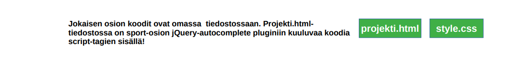
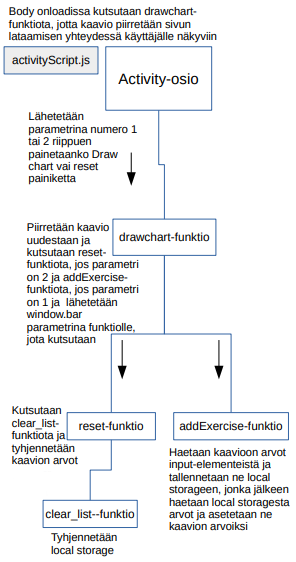
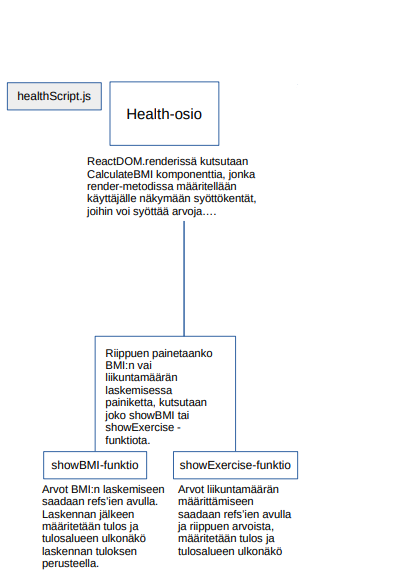
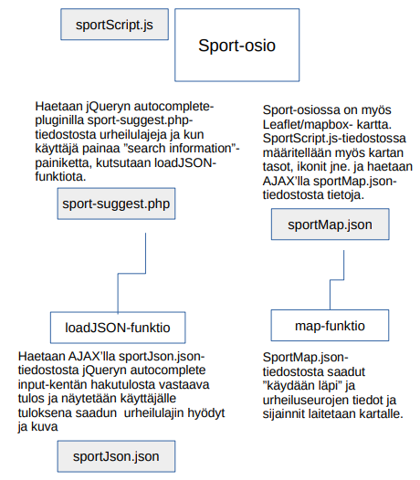

# Sportly
This is a school project that I did in the summer of 2020. This markdown contains documentation both in English and in Finnish.
|Table of contents|
|:------------- |
|1. [Description of the application (in English)](#Sportly---description-of-the-user-interface)|
|2. [Technical solutions of the application (in English)](#Technical-solutions)]
|3. [Description of the application (in Finnish)](#Sportly---Käyttöliittymän-yleiskuvaus)|
|4. [Technical solutions of the application (in Finnish)](#Tekniset-ratkaisut)|

# Sportly - description of the user interface
Sportly is an application in which the user can follow the amount of excercise they have done, check their BMI, check if they excercise enough during a week, search for the benefits of different sports and search for sport clubs in the South Finland. The application is divided into three sections: Activity, Health and Sport.

# Technical solutions
The application contains eight files: index.html, two **JSON** files, one **PHP** file, three JavaScript files and one **CSS** file. I have collected the information about the benefits of the sports and the information of the sport clubs myself and created the JSON files that store the information. I have used jQuery's ajax() method in order to get the values of the JSON files. The PHP file was a ready file that I edited a bit so that it fits to the codes. 

The features of the UI are done with **JavaScript**, **jQuery** and **ReactJS**. The UI contains a map (**Leaflet/mapbox**), a chart (**chart.js**), calculating and a search field (jQuery autocomplete plugin). The values of the chart are saved into the user's **local storage**. In addition to these features the application is **responsive** and I have tried to improve the **accessibility**.

# Sportly - Käyttöliittymän yleiskuvaus
Sportly on sovellus, jonka ideana on tutustuttaa uusiin urheilulajeihin unohtamatta oman kunnon ja terveyden seuraamista. Sportly on jaettu kolmeen eri osioon: Activity, Health ja Sport. Activity-osiossa käyttäjä voi seurata omaa liikkumistaan visuaalisesti pylväsdiagrammilla. Tarkoitus on, että käyttäjä käy kirjaamassa joka päivältä liikunnan määrän ja viikon lopulla voi katsoa, miten on liikkunut viikon aikana. Health-osiossa käyttäjä voi laskea oman painoindeksinsä ja saa tuloksestaan palautetta. Tässä osiossa voi myös laskea, liikkuuko tarpeeksi viikon aikana. Sport-osiossa käyttäjä voi etsiä tietoa eri urheilulajien hyödyistä ja katsoa kartalta myös näiden urheilulajien seuroja Etelä-Suomessa. Tämän osion tarkoituksena on antaa tietoa ja saada kokeilemaan uutta urheilulajia.

# Tekniset ratkaisut
Sovelluksessa on yhteensä kahdeksan eri tiedostoa: index.html, kaksi **JSON**-tiedostoa, yksi **PHP**-tiedosto, kolme JavaScript-tiedostoa ja **CSS**-tiedosto. JSON-tiedostojen tiedot on itse etsittyjä ja koottuja ja myös PHP-tiedostoon on muokattu sopivat arvot. Käyttöliittymän toiminnallisuuden rakentamisessa on käytetty puhdasta **JavaScriptiä** sekä **Reactia** ja siitä on tehty mahdollisimman monipuolinen laittamalla siihen kartta, diagrammi, laskentaa ja tiedonhaku-komponentti.

Projektiin sisällytettyjä teknisiä ratkaisuja: **chart.js** pylväsdiagrammi, **local storage**, React, **jQuery** autocomplete plugin ja hieman muuta toiminnallisuutta myös jQuerylla, tietoa haetaan sekä PHP-tiedostosta että JSON-tiedostoista **Ajaxilla** ja sovelluksessa on **leaflet/mapbox** kartta, jossa itsessään on hieman toiminnallisuutta. Eri teknisten asioiden sisällyttämisen lisäksi sovellus on **responsiivinen** ja **saavutettavuutta** on paranneltu.

Alla näkyy sovelluksen rakenne kuvina:

